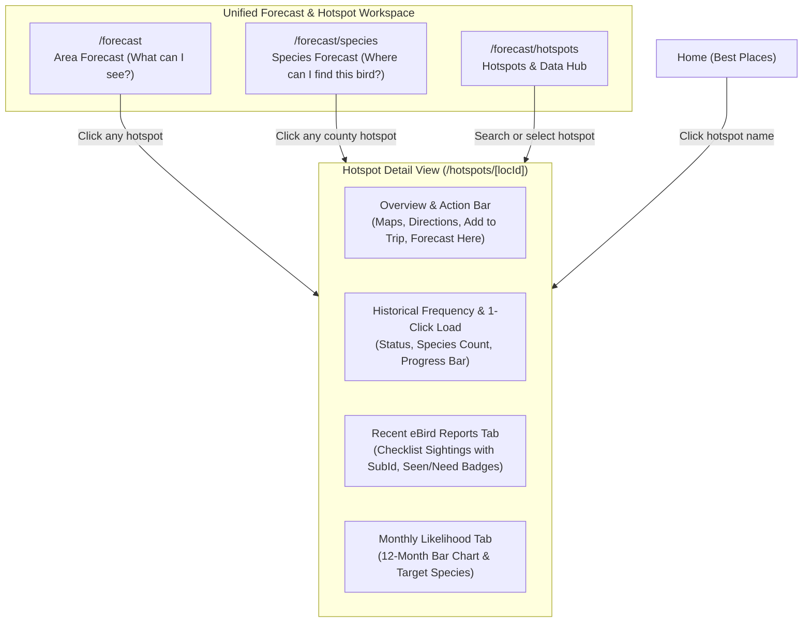

# Implementation Plan: Unified Hotspot & Forecast UX Hub

**File:** `docs/2026-08-18-hotspot-forecast-ux-unified-hub-AGY.md`  
**Author:** AGY (Antigravity Assistant)  
**Date:** 2026-08-18  
**Scope:** UX overhaul for Hotspots, Forecast data loading & progress tracking, and individual eBird report drill-down.

---

## 1. Executive Summary & Problem Diagnosis

The birds app provides rich historical frequency models and live eBird observation feeds, but **hotspots**—the fundamental geographic building blocks of both—have become fragmented across disjointed interfaces with high friction:

### Core Pain Points Identified
1. **Buried and Cluttered Hotspot Loading**:
   - In `/forecast` (Area mode), updating hotspots requires scrolling to a dense, collapsed `<details>` list with dozens of checkboxes.
   - The separation between "unloaded candidates", "outdated loaded sites", and "active jobs" is confusing and visually noisy.
2. **Lost In-Flight Visibility & Progress Regressions**:
   - Background loading via `birds-worker` operates via Postgres queue, but UI progress indicators are fleeting: if a user navigates or refreshes, the in-context progress bar disappears, leaving only the global chip or the admin-like `/forecast/data` page.
   - When jobs complete or encounter partial errors, there is no persistent local feedback confirming what landed.
3. **No Central Hotspot Experience**:
   - Hotspots exist as anonymous data rows in Forecast, 6-item samples in County drill-down, and link-outs on Home Best Places. There is no unified place to search, inspect, or manage hotspots.
4. **Missing eBird Report Drill-Down**:
   - Users cannot see the actual, individual recent eBird checklists/sightings for a specific hotspot inside the app. Clicking a hotspot currently ejects the user to `ebird.org` rather than providing an integrated checklist and target breakdown.

---

## 2. Proposed Architecture & UX Solution



### Key Pillars of the Redesign

### Pillar 1: Dedicated Hotspot Detail View (`/hotspots/[locId]`)
A first-class, responsive view for any eBird hotspot in the system:
- **Location Header**: Hotspot name, County, State, GPS coordinates, verified badge.
- **Action Bar**: Google Maps / Directions, "Forecast my needs here", "Add to Trip", and official eBird link out.
- **Historical Data Manager Card**:
  - Shows current status (e.g. `Loaded: 2016–2025 · 242 species · Current` or `Not Loaded`).
  - **1-Click "Load / Refresh Historical Data" button** that tracks progress with an in-place real-time progress bar.
- **Tab 1: Recent Observations & Checklists**:
  - Fetches recent observations at this hotspot (7 / 14 / 30 day selector) via cached `/data/obs/{locId}/recent`.
  - Groups sightings by date and checklist (`subId`).
  - Direct links to public eBird checklists (`https://ebird.org/checklist/{subId}`).
  - Highlights species with **[Need]** vs **[Seen]** badges and counts.
- **Tab 2: Historical Monthly Forecast**:
  - Full 12-month bar chart for this specific hotspot.
  - Needed species breakdown for any selected month.

### Pillar 2: Unified "Hotspots & Data" Hub (`/forecast/hotspots`)
Elevate `/forecast/data` into a polished, 3rd primary tab in Forecast:
1. **Search & Browse**: Type any city, county, or hotspot name to instantly inspect its status and data.
2. **Active & Recent Jobs Banner**: Prominent, persistent progress cards showing currently executing loads, units processed (`8 of 14 hotspots`), current hotspot being fetched, and cancel options.
3. **Organized State & County Tree**: Collapsible state groups with clear counts (`Florida: 43/67 counties, 182 hotspots`), visual indicators for outdated data, and single-click batch actions.
4. **Failed Loads & Retry Queue**: Transparent list of any hotspots that failed eBird fetching, with 1-click retry.

### Pillar 3: Decluttered Forecast Area View (`/forecast`)
1. Replace the massive, scrolling `<details>` checkbox block at the bottom of the page with a clean **Hotspot Summary Pill/Bar**:
   - `Coverage: 12 of 18 hotspots loaded (6 without data, 1 outdated) · [Manage Hotspots]`
2. The `[Manage Hotspots]` button opens a focused modal or clean inline panel with two simple choices:
   - **"Load All Remaining (6)"** (one tap)
   - **"Choose Individual Hotspots"** (clean modal list with search and distance badges)
3. Every hotspot listed in "Loaded Hotspots in Use" becomes an internal link to its `/hotspots/[locId]` detail page instead of a dead text row.

---

## 3. Data Flow & Technical Changes

### 1. New eBird API Integration: Hotspot Recent Observations
In `src/lib/server/ebird.ts`:
```typescript
/** Recent observations at a single hotspot/location (ref/data/obs/{locId}/recent). */
export async function recentHotspotObs(
  apiKey: string,
  locId: string,
  back: number
): Promise<CachedResult<EbirdObs[]>> {
  const loc = locId.trim();
  return cachedFetch(`hotspotObs:${loc}:${back}`, OBS_TTL_MIN, () =>
    ebirdFetch<EbirdObs[]>(
      `/data/obs/${encodeURIComponent(loc)}/recent?back=${back}`,
      apiKey
    )
  );
}
```

### 2. New Route: `/hotspots/[locId]`
- `+page.server.ts`:
  - Validates `locId` (`L...`).
  - Reads user's seen list & eBird API key.
  - Loads hotspot metadata & stored frequency barchart (if loaded).
  - Fetches recent observations at this hotspot via `recentHotspotObs`.
  - Handles actions: `?/loadHotspot` (enqueues `load_hotspots` job for this single locId).
- `+page.svelte`:
  - Responsive, WCAG AAA layout.
  - Live observation list with checklist subId links and seen/need badges.
  - Real-time `jobsPoll` tracking for this specific `locId`.

### 3. Forecast Tabs Navigation Update
In `src/lib/components/ForecastTabs.svelte`:
```svelte
<nav class="tabs" aria-label="Forecast mode">
  <a href={areaHref} class:active={mode === 'area'}>What can I see?</a>
  <a href={speciesHref} class:active={mode === 'species'}>Where can I find this bird?</a>
  <a href="/forecast/hotspots" class:active={mode === 'hotspots'}>Hotspots & Data</a>
</nav>
```

---

## 4. Verification Plan

### Automated Tests
- `npm run check` (TypeScript + Svelte diagnostics: 0 errors).
- Unit tests for `recentHotspotObs` caching and parsing.
- Unit tests for hotspot frequency aggregation and observation merging.
- Local test database verification (`npm run test:db:up`).

### Manual Verification
1. **Hotspot Drill-Down**:
   - Click a hotspot from Home "Best Places", Forecast Area list, or Forecast Species county drill-down.
   - Verify it opens `/hotspots/[locId]` with map, directions, and action buttons.
   - Verify recent observations list displays checklist links with valid `https://ebird.org/checklist/{subId}` URLs.
   - Test 1-click "Load Historical Data" and verify real-time progress bar updates smoothly.
2. **Decluttered Forecast**:
   - Verify `/forecast` no longer has bloated bottom `<details>` elements.
   - Test loading missing hotspots via the new streamlined modal/drawer.
3. **Unified Hotspots Tab**:
   - Verify the 3-tab Forecast navigation works across mobile and desktop.
   - Test searching for a hotspot by name and inspecting its status.
