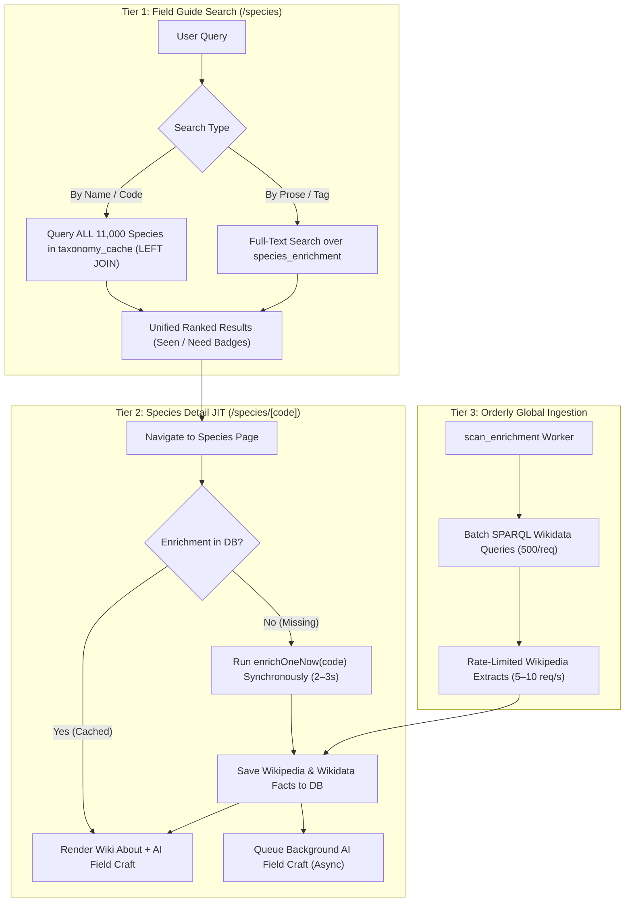

# Species Enrichment & Field Guide: Zero-Empty Architecture Plan (td-0753d0)

**Date:** 2026-08-21  
**Author:** AGY  
**Scope:** `td-0753d0` (Species search must always return info / Field Guide UX & Enrichment Pipeline)

---

## 1. Problem Statement & Root Cause Analysis

### The Problem
When a user searches for a bird species in the Field Guide (`/species`), or navigates to a species detail page (`/species/[code]`), any species that has not previously been scoped via a downloaded hotspot or life list returns **zero search results** or displays a **blank "no data" page**.

### Root Cause
1. **Restricted Scope in `SCOPE_SQL`:**
   In `src/lib/server/species-enrichment.ts`, the background enrichment pipeline only scopes species that are in:
   $$\text{Scope} = \text{seen\_species (life list)} \cup \text{species\_frequency (hotspot/state barcharts)} \cup \text{photo\_links}$$
   The remaining ~9,500 species in the global Clements taxonomy are never enqueued or processed.

2. **Field Guide `INNER JOIN` Excludes Unenriched Taxonomy:**
   In `searchEnrichment()` (`src/lib/server/species-enrichment.ts`), queries execute against:
   ```sql
   FROM species_enrichment se
   JOIN taxonomy_cache tc USING (species_code)
   ```
   Because it is an `INNER JOIN`, any valid worldwide species present in `taxonomy_cache` (~11,000 species) that lacks a row in `species_enrichment` is completely invisible in search results.

3. **Species Detail Page (`/species/[code]`) Hides Content:**
   On `/species/[code]`, `getEnrichment(code)` returns `null` for unenriched species. The *About* and *Finding this bird* cards are hidden entirely for non-admin users, with no mechanism for a user to trigger on-demand enrichment.

---

## 2. Proposed Architecture: The Three-Tier Hybrid Engine

To ensure that **no species search or page view ever comes up empty**, we propose a three-tier hybrid model combining taxonomy federation, real-time Just-in-Time (JIT) resolution, and orderly background ingestion.



---

## 3. Detailed Component Plan

### Tier 1: Taxonomy-First Search (`/species`)
* **Modify `searchEnrichment()` to use `LEFT JOIN`**:
  * Free-text name matching (`com_name ILIKE $q` or `sci_name ILIKE $q`) executes across all ~11,000 species in `taxonomy_cache`.
  * Prose and tag filtering executes against `species_enrichment.search_tsv`.
  * Results are ranked with name-tier matches first, followed by text relevance (`ts_rank_cd`), followed by alphabetical sort.
* **UI Affordance:**
  * Species without stored enrichment display their common name, scientific name, and family directly from `taxonomy_cache`, along with their Seen/Need badge and a clean subtitle (e.g. *"eBird Taxonomy · Tap for details"*).

### Tier 2: Real-Time Just-In-Time (JIT) Enrichment on View
* **Automatic Server-Side Loader Resolution:**
  * In `src/routes/species/[code]/+page.server.ts`, if `getEnrichment(code)` returns `null` or a stale state, the loader invokes the existing `enrichOneNow(code)` pipeline inline (wall-budgeted at 5–10s with `AbortSignal`).
  * `enrichOneNow` queries Wikidata for structured facts (IUCN status, mass, wingspan) and fetches Wikipedia plaintext/sections, persisting the result to `species_enrichment`.
  * The page renders the full *About* card immediately on first visit.
* **Asynchronous AI Field Craft Queueing:**
  * When `enrichOneNow` succeeds with a new Wikipedia article, it automatically enqueues the `aiOnly` job chunk for Anthropic Sonnet field-craft tag generation in the background.

### Tier 3: Orderly Background Ingestion of Global Taxonomy
* **Wikipedia / Wikidata Phase ($0 API Cost):**
  * Expand `scan_enrichment` to iterate through the entire `taxonomy_cache` in sequential, bounded batches (e.g. 200–500 species per day).
  * In ~2–3 weeks, all ~11,000 global species will have their Wikipedia extracts and Wikidata facts cached locally in PostgreSQL (~150–250MB total database size).
* **AI Field Craft Phase (Cost-Bounded):**
  * Keep Sonnet AI field-craft generation targeted:
    1. Automatic for all species in the user's life list (`seen_species`) and active regional barcharts (`species_frequency`).
    2. Automatic on-demand whenever an unenriched species is viewed by a user.
    3. Keeps Anthropic API spend minimal while ensuring high-value local birds have rich behavioral field craft.

---

## 4. UX Review & Field Guide Enhancements

1. **Instant Search Feedback:**
   * Provide immediate name matching across the full Clements taxonomy as the user types, ensuring species like *Shoebill*, *Spix's Macaw*, or *Common Kingfisher* are never omitted.
2. **Graceful Loading & Fallback:**
   * If a JIT lookup takes >1.5s, render the taxonomy header and eBird links immediately while Wikipedia content loads in-place.
3. **Transparent Data Provenance:**
   * Maintain strict adherence to `cs.md` attribution:
     * Wikipedia CC BY-SA 4.0 license line + revision permalink in `<details>`.
     * Explicit "AI-generated from Wikipedia article" label on *Finding this bird*.
     * Separate eBird taxonomy and observation attribution.

---

## 5. Summary of Deliverables & Impact

* **`td-0753d0` Requirement Met:** Every species query returns comprehensive taxonomic and descriptive data.
* **No Dead Ends:** Users never encounter an empty "no data" error for any real bird species.
* **Cost & Performance Balance:** High-volume Wikipedia data is pre-ingested globally for free; LLM field-craft generation is targeted and cost-controlled.
